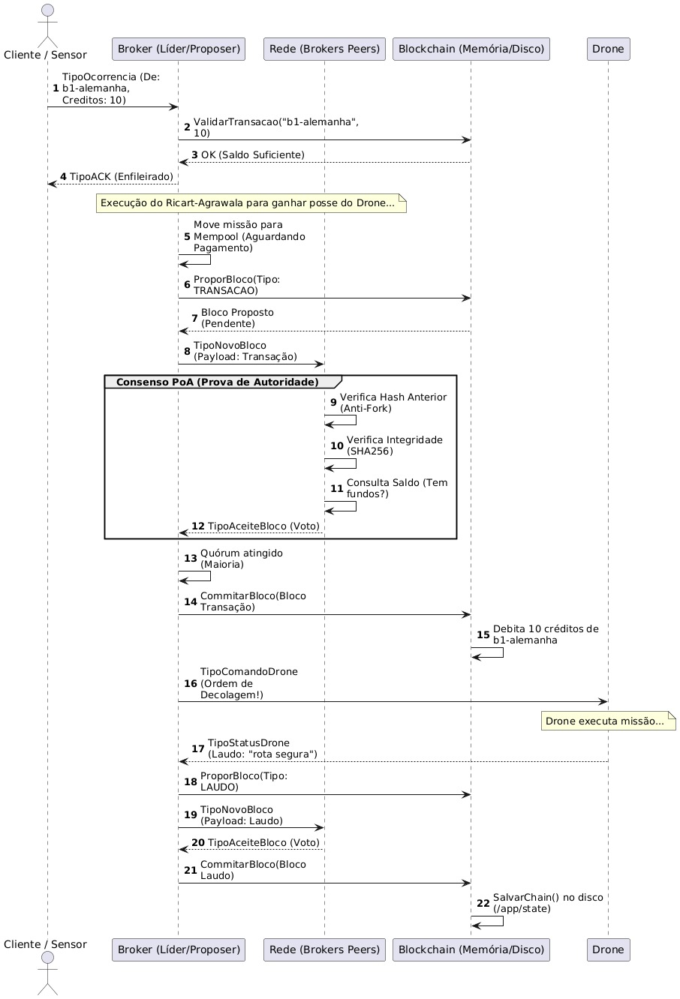
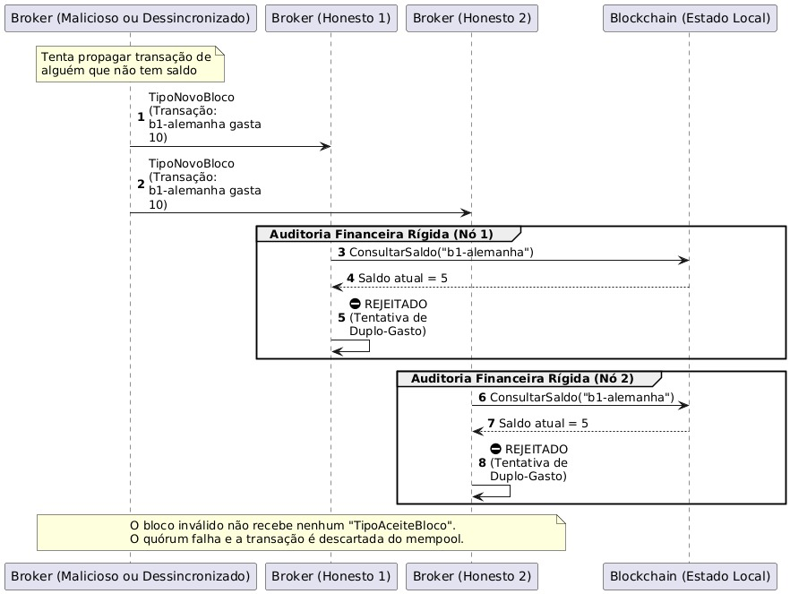
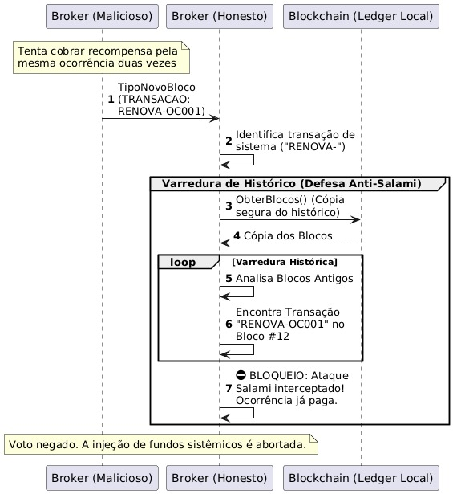
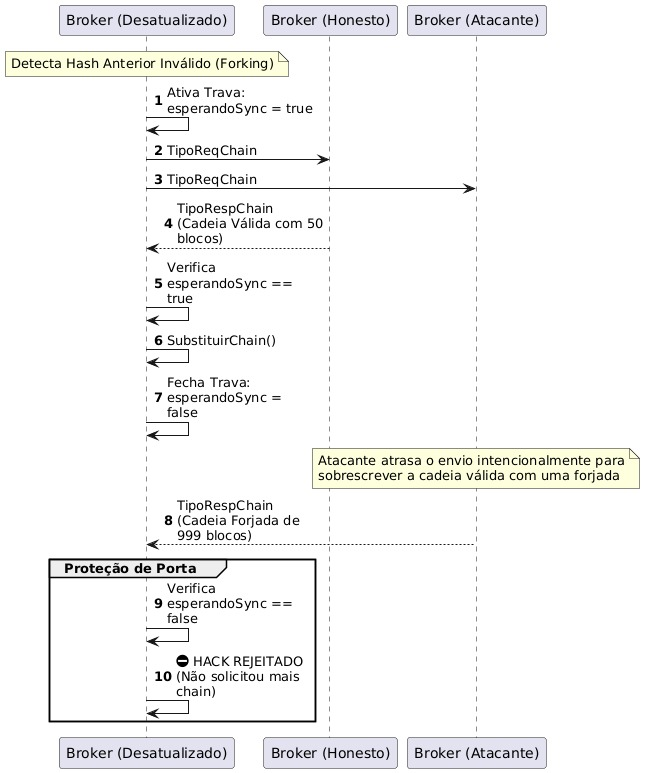

# 🛳️ Strait of Hormuz & Maritime Ledger: Blockchain Distribuída para Coordenação de Drones


---

## 📌 Sobre o Projeto

Este projeto implementa um **sistema distribuído de coordenação de drones em Golang**, no qual cinco brokers totalmente descentralizados (sem coordenador único) negociam o acesso a uma frota de drones compartilhada e registram cada transação e laudo de missão em uma **blockchain própria com consenso PoA (Prova de Autoridade)**. Cada broker representa um agrupamento de países (por continente), que pagam **créditos** em troca de escoltas de drone pelo Estreito de Ormuz.

Diferente da primeira versão do sistema — que usava o **Algoritmo Bully** para eleger um coordenador — esta versão adota o **Algoritmo de Ricart-Agrawala**, eliminando completamente a figura de líder: todo broker disputa a região crítica (o direito de despachar um drone) diretamente com os demais nós, via troca de mensagens `REQUEST`/`OK` ordenadas por relógio lógico de Lamport.

Projeto desenvolvido para a disciplina de Redes e Sistemas Distribuídos (PBL) — UEFS.

---

## 🎯 Objetivo do Projeto

O sistema simula um **ambiente de vigilância marítima distribuída**, onde sensores e operadores reportam ocorrências e cada broker negocia com seus pares o direito de despachar um drone, debitando créditos da companhia solicitante somente após o pagamento ser confirmado pela rede. O objetivo é explorar:

- Exclusão mútua distribuída sem coordenador, com o **Algoritmo de Ricart-Agrawala**
- Relógios lógicos de Lamport para ordenação causal de requisições concorrentes
- Consenso por maioria (PoA) para validar blocos de transação e de laudo
- Blockchain encadeada por hash SHA-256, com persistência local em disco
- Fila de prioridade com heap + *aging* anti-starvation
- Defesas ativas contra fraude: duplo-gasto, ataque Salami, forjamento de cadeia e adulteração de payload
- Comunicação criptografada via TLS, com heartbeat e reconexão automática
- Containerização e orquestração com Docker Compose

---

## 🚀 Principais Funcionalidades (Features)

* **Exclusão Mútua com Ricart-Agrawala:** não existe líder. Antes de despachar um drone, o broker envia `RA_REQUEST` (com relógio de Lamport e prioridade da ocorrência) a todos os peers e só entra na região crítica após receber `RA_OK` de todos. Empates são resolvidos por prioridade da ocorrência → relógio lógico → ID do broker, nesta ordem.
* **Blockchain com Consenso PoA:** toda transação de créditos e todo laudo de missão é proposto como um bloco, propagado via `NOVO_BLOCO`, auditado por cada peer e só é commitado após atingir **quórum de maioria simples** (`votos ≥ total/2 + 1`).
* **Sistema de Créditos por País:** cada broker administra um grupo fixo de países/continente, cada um iniciando com 100 créditos. Toda escolta custa 10 créditos, debitados do ledger somente depois do bloco de transação ser aprovado pela rede — o drone só decola após a confirmação do pagamento.
* **Defesas Anti-Fraude na Blockchain:** cada nó audita o bloco recebido antes de votar — rejeita hash anterior divergente (anti-forking), hash adulterado (integridade), tentativa de duplo-gasto (saldo insuficiente) e tentativa de cobrar duas vezes pela mesma ocorrência (*ataque Salami*), varrendo o histórico completo da chain antes de aprovar recompensas.
* **Recuperação de Forks e Crash-Recovery:** ao detectar um `hash_anterior` inconsistente, o broker abre uma "janela de sincronização" (`esperandoSync`), solicita a chain completa aos peers (`REQ_BLOCKCHAIN`), valida e substitui sua cadeia local — e fecha a janela imediatamente, rejeitando qualquer chain não solicitada que chegue fora desse intervalo.
* **Persistência Atômica em Disco:** cada broker salva blocos e saldos em `chain_<id>.json` via escrita atômica (arquivo temporário + `rename`), recuperando o estado completo automaticamente ao reiniciar — sem depender da rede para reconstituir o ledger.
* **Recarga Protocolar Automática:** um *loop* de background injeta uma transação de recarga (+100 créditos) sempre que o saldo de um país cai abaixo de 20, mantendo a operação contínua mesmo sob alta demanda.
* **Broker Malicioso para Testes:** o broker 5 pode ser ativado em modo `MALICIOUS`, simulando aleatoriamente três tipos de ataque — Salami, fork estrutural e adulteração de payload — usados para validar as defesas dos brokers honestos em tempo real.
* **Frota de Drones Compartilhada:** cada drone se registra em **todos** os brokers do cluster (não só no seu setor de origem), permitindo fallback automático caso o broker responsável fique indisponível.
* **Sensores Automáticos por Setor:** dois sensores por setor geram ocorrências com prioridade probabilística (10% crítico, 30% alerta, 60% aviso) em intervalos configuráveis via variáveis de ambiente.
* **Comunicação 100% TLS:** brokers, drones, sensores, cliente e tester se conectam exclusivamente via TLS (com fallback para TCP puro em ambiente de desenvolvimento sem certificado).
* **Heartbeat e Detecção de Falhas:** cada broker envia `HEARTBEAT` periódico aos peers; a ausência de resposta por um intervalo configurável remove o peer da rede e libera requisições de Ricart-Agrawala pendentes contra ele, evitando deadlocks.

---

## 📡 Especificação do Protocolo

Toda comunicação roda sobre **TCP + TLS**, usando o envelope universal `protocol.Mensagem` (campos `tipo`, `id_origem`, `timestamp`, `payload`):

| Categoria | Tipo | Descrição |
|---|---|---|
| Drones | `NOVA_TAREFA` | Sensor/cliente reportando uma ocorrência |
| Drones | `COMANDO_DRONE` | Broker ordenando a decolagem do drone |
| Drones | `STATUS_DRONE` | Drone reportando o laudo da missão concluída |
| Drones | `REGISTRO_DRONE` | Drone se apresentando ao cluster |
| Drones | `RESERVA_DRONE` | Broadcast informando que um drone foi reservado |
| Drones | `ACK` | Confirmação de recebimento |
| Ricart-Agrawala | `RA_REQUEST` | Pedido de entrada na região crítica (com relógio + prioridade) |
| Ricart-Agrawala | `RA_OK` | Permissão concedida ao solicitante |
| Conexão | `HANDSHAKE` | Primeira mensagem ao conectar, identifica o tipo de nó |
| Conexão | `HEARTBEAT` / `PONG` | Sinal de vida periódico entre brokers |
| Blockchain | `TRANSACAO` | Pagamento de créditos por uma escolta |
| Blockchain | `LAUDO_MISSAO` | Laudo final de uma missão, registrado em bloco |
| Blockchain | `NOVO_BLOCO` | Broadcast de bloco proposto para os peers |
| Blockchain | `ACEITE_BLOCO` | Voto de aceite de um peer (consenso PoA) |
| Blockchain | `REQ_BLOCKCHAIN` / `RESP_BLOCKCHAIN` | Pedido e resposta de sincronização de chain |
| Blockchain | `CONSULTA_SALDO` / `RESP_SALDO` | Consulta de saldo de créditos de uma companhia |

---

## 🏗️ Arquitetura do Sistema

O sistema é dividido em 8 componentes principais:

1. **Broker (×5):** ...
2. **Drone (×5):** ...
3. **Sensor (×8):** ...
4. **Client:** ...
5. **Tester:** ...
6. **Protocol:** ...
7. **Blockchain:** ...
8. **State:** ...

### Arquitetura Geral

O diagrama abaixo apresenta uma visão macro da arquitetura distribuída do sistema. Cada broker mantém sua própria blockchain e coordena o acesso aos drones compartilhados por meio do algoritmo de Ricart-Agrawala. Sensores e clientes geram ocorrências, que entram em uma fila de requisições até que um drone seja reservado, execute a missão e registre o laudo na blockchain. (**Obs**: O Broker 5 não é registrado na Arquitetura Geral em razão do seu papel de validação de casos de erro).


---

## 🔄 Modelagem e Fluxos do Sistema

Os diagramas de sequência abaixo detalham o ciclo de vida completo de uma ocorrência e as defesas da blockchain contra os três vetores de ataque mais comuns em sistemas de ledger distribuído.

### 1. Ciclo de Vida Completo de uma Ocorrência

Do recebimento da ocorrência até a decolagem do drone, passando pela disputa de Ricart-Agrawala, o consenso PoA para o bloco de transação, o débito de créditos, o despacho físico, a execução da missão e o segundo bloco (o laudo) que encerra o fluxo com a persistência da chain em disco.



### 2. Defesa contra Duplo-Gasto

Um broker malicioso (ou dessincronizado) tenta propagar uma transação debitando créditos de uma companhia sem saldo suficiente. Cada broker honesto realiza uma **auditoria financeira rígida** antes de votar — consulta o saldo real no próprio ledger e nega o aceite. Sem quórum de maioria, o bloco fraudulento nunca é commitado e a transação é descartada do mempool.



### 3. Defesa contra Ataque Salami

Um broker malicioso tenta cobrar a recompensa de renovação do Ricart-Agrawala duas vezes pela mesma ocorrência (`RENOVA-OC001`). Antes de validar a transação, o broker honesto identifica que é uma transação de sistema e faz uma **varredura completa do histórico de blocos** (`ObterBlocos()`), encontra o pagamento original e bloqueia o voto — interceptando o ataque Salami antes que ele drene o fundo operacional em pequenos incrementos repetidos.



### 4. Defesa contra Forking e Recuperação após Crash

Um broker detecta que o `hash_anterior` de um bloco recebido não corresponde ao seu próprio topo de chain — sinal de um fork. Ele ativa a trava `esperandoSync`, solicita a chain completa aos peers e, ao receber a primeira resposta válida, substitui sua cadeia local e **fecha a trava imediatamente**. Qualquer chain forjada que chegue depois da janela de sincronização (como a tentativa do atacante de sobrescrever a cadeia válida com uma forjada de 999 blocos) é rejeitada, pois o broker não está mais esperando sincronização.



---

## 🛡️ Resumo das Defesas Implementadas

| Ataque Simulado | Camada de Defesa | Resultado |
|---|---|---|
| Hash anterior divergente (fork estrutural) | Verificação de encadeamento antes de qualquer voto | Bloco rejeitado; broker abre janela de sincronização |
| Hash do bloco adulterado | Recálculo de `CalcularHash` e comparação | Bloco rejeitado por quebra de integridade |
| Duplo-gasto (saldo insuficiente) | Consulta de saldo real no ledger antes de votar | Bloco rejeitado; quórum nunca é atingido |
| Recompensa de RA inflada (> 5 créditos) | Limite fixo validado por todos os peers | Bloco rejeitado |
| Ataque Salami (cobrança duplicada da mesma ocorrência) | Varredura do histórico completo da chain | Voto negado; transação descartada do mempool |
| Recarga sistêmica fora das regras (valor ≠ 100 ou saldo já suficiente) | Validação das regras de recarga automática | Bloco rejeitado |
| Injeção de chain forjada não solicitada | Trava `esperandoSync` fechada fora da janela de sync | Chain recebida é descartada |

---

## 📂 Estrutura do Projeto (Física e Lógica)

A execução do ecossistema agora está segregada por diretórios específicos para espelhar a distribuição em duas máquinas reais:

```text
Strait-of-Hormuz-and-Maritime-Ledger/
│
├── files_pc1/                 # Ambiente Host 1 (Brokers 1, 2 e complementos)
│   ├── docker-compose.yml
│   └── Makefile
│
├── files_pc2/                 # Ambiente Host 2 (Brokers 3, 4, 5 e complementos)
│   ├── docker-compose.yml
│   └── Makefile
│
├── blockchain/                # Ledger: blocos, hash SHA-256, saldos, persistência atômica
│   └── blockchain.go
├── broker/                    # Nó do cluster: RA, heartbeat, TLS, blockchain, despacho
│   └── broker.go
├── client/                    # Terminal de comando interativo
├── drone/                     # Atuador compartilhado entre todos os brokers
├── protocol/                  # Envelope universal de mensagens + structs de domínio
├── sensor/                    # Gerador automático de ocorrências por setor
├── state/                     # Fila de prioridade com Aging + persistência state
├── tester/                    # Diagnóstico, stress-test e monitor de consenso
│
├── Docs/                      # Diagramas de arquitetura
├── config.json                # Mapa de rede do cluster
├── gen-certs.sh               # Gerador de certificado TLS
└── Dockerfile.* # Dockerfiles de todos os serviços
---

## ⚙️ Configuração da Rede (`config.json`)

O arquivo `config.json` mapeia o ID de cada broker ao seu respectivo endereço IP/DNS. Esse arquivo é montado como volume na raiz da configuração e é utilizado por todos os componentes para localizar os brokers da rede.

```json
{
  "1": "172.16.201.14:9081",
  "2": "172.16.201.14:9082",
  "3": "172.16.201.13:9083",
  "4": "172.16.201.13:9084",
  "5": "172.16.201.13:9085"
}
```

### Mapa de Companhias por Broker

| Host | Broker | Setor | Países |
|------|--------|--------|---------|
| PC 1 | broker1 | Europa | Alemanha, França, Itália, Inglaterra |
| PC 1 | broker2 | Ásia / Oriente Médio | China, Japão, Índia, Emirados |
| PC 2 | broker3 | Américas | EUA, Canadá, Brasil, Argentina |
| PC 2 | broker4 | África | Egito, Somália, Djibuti, África do Sul |
| PC 2 | broker5 | Oceania / Sudeste Asiático *(nó malicioso)* | Austrália, Nova Zelândia, Indonésia, Filipinas |

---

## 💰 Sistema de Créditos

| Regra | Valor |
|--------|------:|
| Saldo inicial por país | **100 créditos** |
| Custo de uma escolta de drone | **10 créditos** |
| Recompensa por renovação de Ricart-Agrawala | **até 5 créditos** |
| Limite para recarga automática | **Saldo < 20 créditos** |
| Valor da recarga protocolar | **100 créditos** |

> **Importante:** o saldo somente é debitado após o bloco da transação ser aprovado pelo consenso **Proof of Authority (PoA)** (maioria dos brokers vivos). Até essa confirmação, a solicitação do drone permanece na **mempool**.

---

## 🛠️ Pré-requisitos

Antes de executar o sistema, certifique-se de possuir:

- Docker e Docker Compose instalados em ambos os hosts (PC 1 e PC 2);
- Conectividade de rede entre as máquinas (ex.: `172.16.201.14` e `172.16.201.13`);
- OpenSSL instalado para geração dos certificados TLS.

---

# 🐳 Configuração e Execução

## Passo 1 — Geração dos Certificados

No computador primário, gere as chaves criptográficas **apenas uma vez**. Certifique-se de que os arquivos `cert.pem` e `key.pem` também sejam copiados para o código que será executado no PC 2.

```bash
chmod +x gen-certs.sh
./gen-certs.sh
```

---

## Passo 2 — Execução no PC 1 (`172.16.201.14`)

Entre no diretório correspondente e inicialize o primeiro host.

```bash
cd files_pc1
make up-full
```

---

## Passo 3 — Execução no PC 2 (`172.16.201.13`)

No segundo computador, execute:

```bash
cd files_pc2
make up-full
```

---

## Comandos do Makefile

Execute dentro do respectivo diretório (`files_pc1` ou `files_pc2`).

```bash
make up-test   # Brokers + drones + client + tester (sensores desligados)
make up-full   # Ecossistema completo (incluindo sensores)
make tester    # Terminal de estresse do Tester
make client    # Terminal do Client
make logs      # Acompanha logs principais
make down      # Encerra o cluster local e remove blockchain/saldos persistidos
```

> **Observação:** `make down` remove o volume `/state`. Na próxima inicialização, o cluster começará uma nova blockchain contendo apenas o **Bloco Gênesis**.

---

# 💻 Terminal de Comando (Cliente)

Para inserir ocorrências manualmente no sistema (normalmente a partir do **PC 1**):

```bash
cd files_pc1
make client
```

Exemplo de utilização:

```text
==================================================
   Terminal de Comando — Estreito de Ormuz P3
==================================================

Companhia ativa: b1-alemanha

Comandos:
[1] Enviar ocorrência
[2] Consultar saldo
[3] Trocar companhia
[sair]

> 1

Descrição da ocorrência (ou 'sair'):
Navio pirata interceptado

Prioridade (1=Aviso, 2=Alerta, 3=Crítico):
3

✅ Ocorrência CLI-host-OC0001 aceita pelo broker!
```

---

## 🧪 Tester — Diagnóstico, Stress-Test e Simulação de Ataques

```bash
docker attach $(docker-compose ps -q tester)
```

```
ping   broker1:9081                    # mede RTT até um broker
req    broker2:9082 3 5                # envia 5 ocorrências de prioridade 3
req    broker3:9083 2 3 b3-brasil       # com companhia específica
autoOK off                             # modo manual de Ricart-Agrawala
ok     broker1                         # envia RA_OK manualmente a um broker
chain  broker1:9081                    # exibe a blockchain de um nó
saldo  broker1:9081 b1-alemanha        # consulta saldo de uma companhia
watch  on                              # monitora o consenso de blocos em tempo real
quit                                   # encerra o terminal
```

### Ativando o broker malicioso

O `broker5` aceita a variável de ambiente `MALICIOUS=true` (já configurada por padrão no `docker-compose.yml`). Quando ativo, a cada proposta de bloco ele sorteia um dos três ataques — Salami, fork estrutural ou adulteração de payload — permitindo observar, em tempo real, as defesas dos brokers honestos descritas na seção de [Modelagem e Fluxos do Sistema](#-modelagem-e-fluxos-do-sistema).

---

## 📐 Decisões de Projeto

| Componente | Origem | Justificativa |
|---|---|---|
| Protocolo de mensagens | Felipe | Envelope tipado + ACK garantido |
| Ricart-Agrawala | Daniel | Exclusão mútua sem coordenador único, com prioridade e relógio de Lamport |
| TLS + Heartbeat | Daniel | Segurança na camada de transporte e detecção de falhas |
| Fila com Aging | Felipe + Daniel | O(log n) + prevenção de starvation de ocorrências antigas |
| config.json + Docker | Felipe | Configuração declarativa, sem IPs hardcoded |
| Blockchain PoA | Felipe + Daniel | Imutabilidade, anti-duplo-gasto e auditoria descentralizada |
| Companhias por país/continente | Felipe | Simula geopolítica real do tráfego no Estreito de Ormuz |
| Broker malicioso (testes) | Felipe + Daniel | Validação contínua das defesas da blockchain em ambiente controlado |

---

## 📚 Referências e Links Úteis

**Golang & Infraestrutura**
* [Documentação Oficial do Go (Golang)](https://go.dev/doc/) — Base para Goroutines, canais e gerenciamento de memória concorrente.
* [Go by Example: Mutexes](https://gobyexample.com/mutexes) — Referência para implementação de Thread-Safety e prevenção de Race Conditions.
* [Pacote `net` do Go](https://pkg.go.dev/net) — Conexões TCP, `DialTimeout` e `SetReadDeadline`.
* [Pacote `crypto/tls` do Go](https://pkg.go.dev/crypto/tls) — Configuração de TLS para servidores e clientes.
* [Pacote `encoding/json` do Go](https://pkg.go.dev/encoding/json) — Serialização e desserialização das mensagens do protocolo distribuído.
* [Pacote `container/heap` do Go](https://pkg.go.dev/container/heap) — Interface nativa usada para implementar a fila de prioridade de ocorrências.

**Estruturas de Dados**
* [Golang: Heap Data Structure — YuminLee (Medium)](https://yuminlee2.medium.com/golang-heap-data-structure-45760f9562dc) — Referência principal para a fila de prioridade que garante o despacho das ocorrências mais críticas primeiro.

**Algoritmos Distribuídos**
* [Ricart–Agrawala Algorithm — GeeksforGeeks](https://www.geeksforgeeks.org/operating-systems/ricart-agrawala-algorithm-in-mutual-exclusion-in-distributed-system/) — Embasamento teórico para o algoritmo de exclusão mútua sem coordenador, usado para decidir qual broker ganha o direito de despachar um drone.
* [Ricart–Agrawala algorithm — Wikipedia](https://en.wikipedia.org/wiki/Ricart%E2%80%93Agrawala_algorithm) — Visão geral formal do algoritmo, suas mensagens REQUEST/REPLY e a otimização sobre o algoritmo de Lamport.
* [Distributed Systems: Principles and Paradigms — Tanenbaum & Van Steen](https://www.distributed-systems.net/index.php/books/ds3/) — Referência acadêmica para os conceitos de exclusão mútua, comunicação entre processos e tolerância a falhas abordados no projeto.

**Blockchain e Segurança**
* [Pacote `crypto/sha256` do Go](https://pkg.go.dev/crypto/sha256) — Função de hash usada no encadeamento dos blocos e na verificação de integridade.
* [Diferenças entre TCP e UDP (Cloudflare)](https://www.cloudflare.com/pt-br/learning/ddos/glossary/tcp-ip/) — Embasamento para a escolha do TCP como protocolo de transporte, dada a necessidade de entrega garantida das transações.

---

## 👨‍💻 Autores

* **Felipe Bastos Coelho**
* **Daniel Porto Braz**

---

## ⚖️ Licença

Este projeto está sob a licença MIT. Consulte o arquivo [LICENSE](LICENSE) para mais detalhes.
